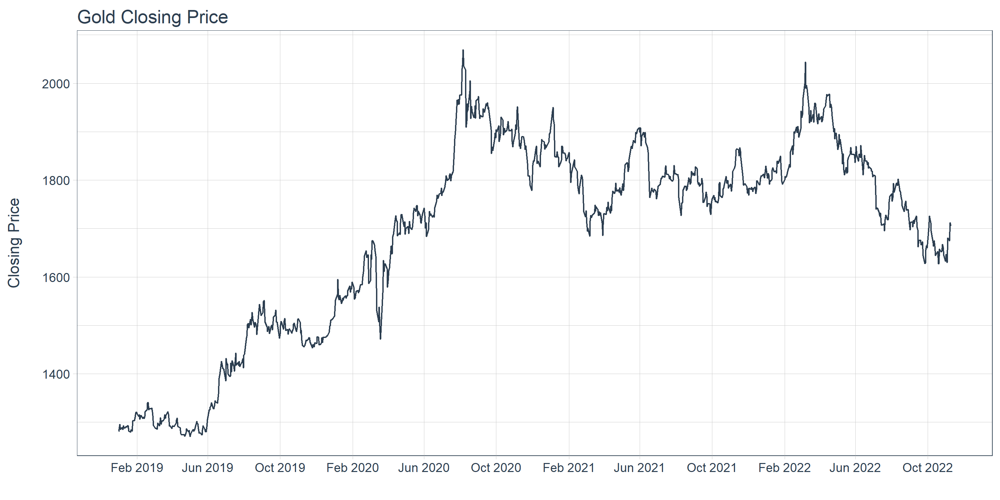
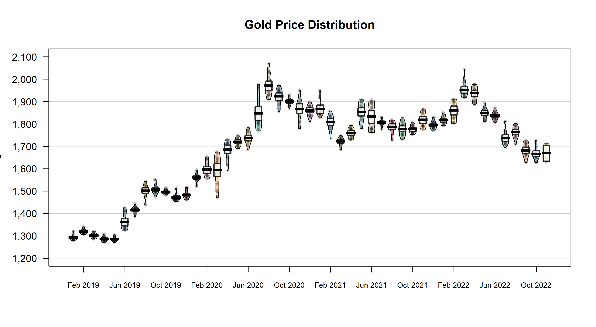

Gold Price EDA
================
Rachdyan
2023-02-03

## Introduction

We want to create a visualization from the gold prices data we have

First, load the library needed

``` r
library(dplyr)
library(ggplot2)
library(lubridate)
library(yarrr)
library(xlsx)
library(tidyquant)
```

## Load the Data

Load the data from the excel file

``` r
gold_prices <- read.xlsx("./data/gold_prices_with_news.xlsx", 1)
gold_prices <- gold_prices[1:1005,]
```

## Time Series Plot

The time series plot displays the gold closing price between Feb 2019
and Oct 2022

``` r
gold_prices %>%
  ggplot(aes(x=Date,y=Closing.Price))+
  geom_line(color = palette_light()[[1]])+
  labs(y="Closing Price\n", 
       x="",
       title = "Gold Closing Price") + 
  scale_x_date(date_breaks = "4 month", date_labels = "%b %Y") +
  theme_tq()
```

<!-- -->

## Pirate Plot

To better understand the data, we can create a pirate plot. Pirate plot
combined raw data, descriptive statistics and inferential statistics
into a single plot

``` r
####### Create a new column to store the month
gold_prices <- gold_prices %>% mutate(month_year = format_ISO8601(Date, precision = "ym")) 

#### Create the Gold Price Distribution Plot without the x label
pirateplot(formula = Closing.Price ~ month_year, 
           data = gold_prices,
           xaxt = "n",
           ylab = "Closing Price\n",
           xlab = "",
           main = "Gold Price Distribution")  

######### Create custom x label for visual purpose
xlabels <- unique(gold_prices$month_year)
xlabels <- ym(xlabels) %>% format('%b %Y')
xlabels_fix <- xlabels[seq(2, length(xlabels), 4)]
axis(1, at = seq(2, length(xlabels), 4), xlabels_fix, cex.axis = 0.75)
```

<!-- -->
